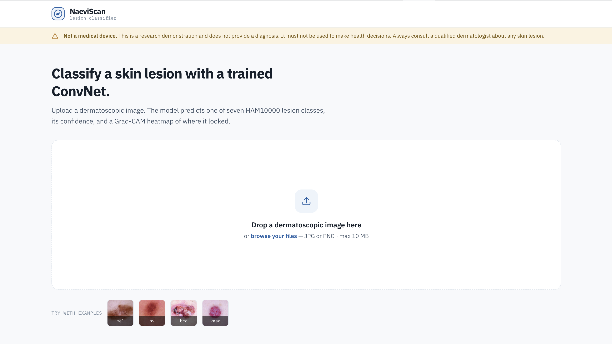

# NaeviScan — Skin Lesion Classifier

> Calibrated, explainable dermatoscopic lesion classifier — 7 lesion types, fine-tuned EfficientNetV2-S, served as a Flask + Docker web app.

**🔗 [Live demo](https://arnaudpaquet-naeviscan.hf.space)** · **[Model weights (v1.0.0)](https://github.com/Arnaud-Paquet/Skin-Cancer-Detection/releases/latest)** · **[HAM10000 dataset](https://dataverse.harvard.edu/dataset.xhtml?persistentId=doi:10.7910/DVN/DBW86T)**

[](https://www.python.org/)
[](https://pytorch.org/)
[](#license)
[](https://huggingface.co/spaces/ArnaudPaquet/naeviscan)



> ⚠️ **Not a medical device.** This is an academic ML demonstration and provides no clinical diagnosis. It must not be used to make health decisions. Always consult a qualified dermatologist about any skin lesion of concern.

---

## Results

Held-out test set, lesion-grouped split (no `lesion_id` shared with train or val):

| Metric                       | Value     |
| ---------------------------- | --------- |
| Balanced accuracy            | **75.2%** |
| Macro F1                     | 0.70      |
| Melanoma F1                  | 0.62      |
| Melanoma recall              | 71.4%     |
| Melanoma precision           | 55.3%     |
| Expected Calibration Error   | **2.98%** (down from 4.01% pre-calibration) |
| Calibration temperature `T`  | 0.8722    |

Inference combines 9-pass test-time augmentation (TTA) with post-hoc temperature scaling for calibration, and a Grad-CAM heatmap for explainability — all in ~4 s on the free Hugging Face CPU tier.

---

## Quickstart

```bash
git clone https://github.com/Arnaud-Paquet/Skin-Cancer-Detection.git
cd Skin-Cancer-Detection

# Download trained weights (~80 MB) from the latest release
mkdir -p app/models
curl -L -o app/models/best_efficientnet_v2_s.pth \
  https://github.com/Arnaud-Paquet/Skin-Cancer-Detection/releases/download/v1.0.0/best_efficientnet_v2_s.pth

cd app
pip install -r requirements.txt
python app.py
# Open http://localhost:5000
```

Or build the exact image that runs on Hugging Face Spaces:

```bash
cd app
docker build -t naeviscan:local .
docker run --rm -p 7860:7860 naeviscan:local
# Open http://localhost:7860
```

---

## Project structure

```
skin_cancer_detection/
├── app/                          # Flask + Docker web app
│   ├── app.py                    # WSGI entrypoint, /predict route
│   ├── inference.py              # Model loading, TTA, Grad-CAM
│   ├── config.py                 # Calibration, thresholds, class metadata
│   ├── templates/index.html      # Single-page UI
│   ├── static/                   # JS, samples, styles
│   ├── models/                   # .pth lives here at runtime (gitignored)
│   ├── Dockerfile                # HF Spaces deployment image
│   ├── DEPLOY.md                 # Step-by-step deployment guide
│   └── README.md                 # HF Spaces metadata + description
├── notebook/                     # Training + evaluation notebook
└── README.md                     # This file
```

---

## How it works

### Dataset and splitting

HAM10000 — 10,015 dermatoscopic images across 7 classes, with severe imbalance: melanocytic nevi dominate (~67%), dermatofibroma and vascular lesions are under 1% each. Many images share the same `lesion_id` (multiple captures of the same lesion), so a naive random split contaminates the test set.

I used a **lesion-grouped 70/15/15 split**: every `lesion_id` appears in exactly one of train, val, or test. This kills the contamination and makes the test metric an honest estimate of what happens on unseen lesions.

### Architecture choice

After a comparison phase across five backbones (DenseNet169, VGG16, ResNet50, EfficientNet-B2, EfficientNetV2-S) trained under identical conditions, **V2-S won on both balanced accuracy and melanoma F1**. The classifier head: dropout → 256-d linear → SiLU → dropout → 7-class linear. Stochastic depth (`drop_path=0.3`) is on during training and bypassed in eval mode.

### Training recipe

- **MixUp** (α = 0.2) for the bulk of training, disabled in the last 5 epochs so the model can sharpen on clean targets.
- **EMA of weights** (decay = 0.999) — the EMA copy is evaluated on val and saved as the checkpoint.
- **Label smoothing** (ε = 0.1) in CrossEntropyLoss — discourages overconfident logits and pairs naturally with temperature scaling later.
- **BF16 autocast** on Colab Pro+ (L4 / A100). FP16 produced NaN losses on V2-S; BF16's wider exponent range is critical for the fused-MBConv kernels.
- **Composite metric** = macro F1 + α·mel F1 (not recall). An earlier iteration used recall as the headline criterion and produced a model that flagged ~half of all benign lesions as melanoma. Switching to F1 and dropping class-weighted loss fixed it.

### Calibration

The raw model was slightly under-confident — label smoothing, EMA averaging, and TTA all compound to damp the softmax. I fit a single-parameter **temperature scaling** by LBFGS on validation logits → **T = 0.8722**. Expected calibration error dropped from **4.01% → 2.98%** on the test set without changing top-1 accuracy. At inference time, logits are divided by `T` before softmax.

### Test-time augmentation

The `/predict` endpoint averages 9 forward passes: 1 center-crop clean view + 8 augmented views (random resized crop, horizontal + vertical flip, affine rotation/shear, color jitter). The averaging both regularizes the prediction and provides a small accuracy bump.

### Explainability

**Grad-CAM** on the last fused-MBConv block (`model.features[-1]`). The activation map of the predicted class is computed via gradient-weighted global average pooling, normalized to [0, 1], resized to the original image, and alpha-blended (α = 0.45) using the `RdYlBu_r` colormap. The user can toggle between the original image and the heatmap with one click in the UI.

### UI: three signals, not a verdict

The web app deliberately surfaces calibrated probabilities through three orthogonal channels rather than a binary diagnosis:

1. **Top-class risk pill** — color-coded by clinical category (benign / pre-cancerous / malignant).
2. **Melanoma concern banner** — driven by the calibrated `p_mel`, with three bands (low / moderate / high) at thresholds 0.30 and 0.70. Conservative on the low end because the cost of an unflagged melanoma far exceeds the cost of a precautionary consultation.
3. **Low-confidence warning** — when the top-class probability stays below 0.45 (significantly above chance, but not confidently committing), the UI shows "multiple classes plausible".

A calibrated `p_mel` of 0.42 is genuinely uncertain. Pretending otherwise misrepresents what the model knows.

### Deployment

The app is a Flask WSGI service served by gunicorn in a slim Python 3.11 Docker image, hosted on Hugging Face Spaces' free CPU tier. CPU-only torch wheels are pinned to keep the image ~1.5 GB smaller than the default CUDA build. Two non-obvious gotchas surfaced during deployment:

- **`gunicorn --preload` + PyTorch causes a fork-time deadlock.** The master loaded the model before forking, and the worker inherited half-initialized PyTorch threading state. The first `/predict` call hung at 0% CPU forever. Fix: drop `--preload` — with a single worker, there's no benefit to preloading anyway.
- **`matplotlib.cm.get_cmap` was removed in matplotlib 3.9.** The HF container installed a newer matplotlib than my local environment, breaking the Grad-CAM overlay. Fix: switch to the `matplotlib.colormaps[...]` registry, which works on 3.7+.

The 80 MB checkpoint ships via GitHub Releases rather than git-LFS in the main repo — keeps `git clone` fast and the release artifact is a single, discoverable download.

---

## What I'd do differently

- **Class-balanced sampling** instead of relying on label smoothing for the minority classes — would likely buy 1–2 points of macro F1.
- **Multi-architecture ensemble** — averaging V2-S with a second backbone (e.g. a small ViT) would tighten both accuracy and calibration.
- **Tuned thresholds** for the concern bands — currently 0.30 / 0.70 are picked by inspection. Tuning them against a clinical objective (e.g. maximize sensitivity at 70% specificity) would be more defensible.

## Known limitations

- HAM10000 is dermatoscopic only — performance on phone-camera images is **unknown** and likely poor without a domain-shift fine-tune.
- Skin-tone diversity in HAM10000 is biased toward Fitzpatrick types I–III.
- 75.2% balanced accuracy is below state-of-the-art (~85% with ISIC pre-training and modern recipes). This project optimizes for *honesty of the pipeline* (proper split, calibration, explainability) rather than chasing a leaderboard number.

---

## References

- Tschandl, P., Rosendahl, C. & Kittler, H. The HAM10000 dataset, a large collection of multi-source dermatoscopic images of common pigmented skin lesions. *Sci Data* **5**, 180161 (2018).
- Tan, M. & Le, Q. EfficientNetV2: Smaller Models and Faster Training. *ICML* (2021).
- Selvaraju, R. R. et al. Grad-CAM: Visual Explanations from Deep Networks via Gradient-based Localization. *ICCV* (2017).
- Guo, C. et al. On Calibration of Modern Neural Networks. *ICML* (2017).

## License

Released under the MIT License.
